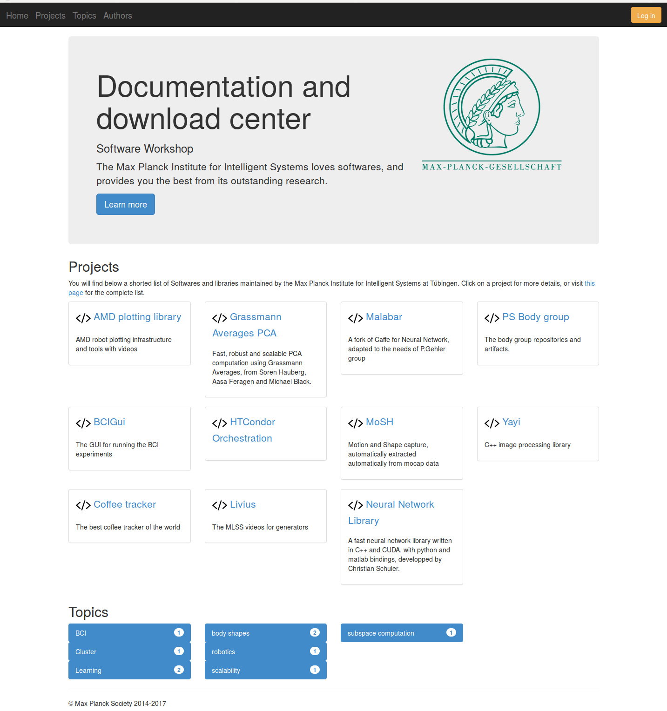
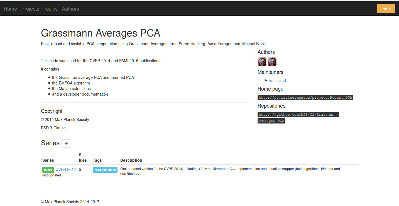
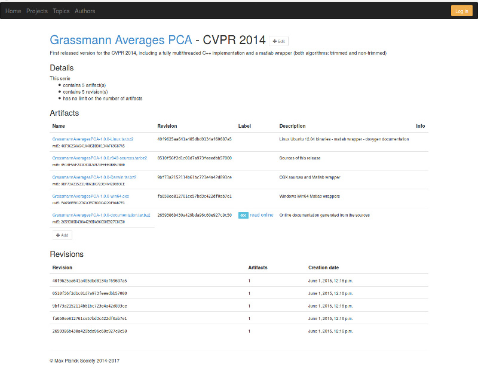

# Documentation and artifacts store django application #

This project provides a simple web application written in Django/python that aims at sharing artifacts and documentation in a public or private way.
It is especially suited to be the companion of a build server that generates the documentation and eg. installers, and needs to make those visible
to a group of developers.

[TOC]

## Workflow of use

An example of workflow that we actually use is:
![workflow][workflow]

## Features

The main features are:

* handling projects and associated metadata, such as descriptions, authors, maintainers, repositories, copyright holders, license,
  home page, etc
* organization of projects by series, the meaning of the series is up to the project. It can be a specific release channel (release, beta or even
  continuous build), a set of packages, etc
* serving HTML documentation: documentation files (zip, tar...) are deflated on the server side and served directly from the web application. Each
  revision is kept (if not explicitly removed) and you can track the evolution of the documentation, have consistent release together with documentation, etc
* a small scripting API that let update/push artifacts from remote, which is especially convenient for Continuous Integration servers such as Atlassian Bamboo or Jenkins
* handling a limit on the number of revisions per series, which works well for continuous builds
* permission management: each of the resources that are served can have a set of permissions applied to it, which
  can be used to restrict the visibility of internal or intermediate work/project
* not so ugly interface using Bootstrap

[workflow]: ./doc/images/code_doc_workflow.png

## Screenshots


### Main page
The main page shows the projects, a short description for each of them, and the "topics".



### Project page
A project consists of information that describe the project (repositories, authors, license, description, logo, etc) and a set of series.
For each series, it is possible to jump directly to the last documentation (by date).



### Series page
A series consists of a description, a date, revisions, each of which is associated with zero or more artifacts and branches. Each artifact
can be a *normal* one, or a documentation one. Documentation artifacts are deflated on server side and served as files.
Each series can have a different set of access permissions.



## License and Copyright #
The project is developed at the [Max Planck Institute for Intelligent Systems](https://is.tuebingen.mpg.de/), Tübingen, Germany, within the [Software Workshop](https://is.tuebingen.mpg.de/en/software-workshop).
It is released under the BSD-3 clauses license.

## Contribution #
This project is still active and any contribution or feature request is welcome. Please use the Bitbucket issue tracker for that.

The main developer/maintainer is Raffi Enficiaud ([here](https://bitbucket.org/renficiaud/) and [here](https://github.com/raffienficiaud)), and a big contributor has been Stephan Wenninger.

## Running the application #
This project is based on the Django framework and has very few dependencies, which makes it easy to run:

```
# create a dedicated virtual environment
> virtualenv my_env
> . my_env/bin/activate

# install the dependencies
> pip install django, pillow, django-markdown, pygments, pytz
```

and now you can just test the application as follow (we deflate Bootstrap which is part of the source code):

```
#!bash
> cd <code_doc-respository>/code_doc/static
> unzip bootstrap-3.2.0-dist.zip
> cd <code_doc-respository>/
> python manage.py migrate
> python manage.py runserver
```

If there is no error message, you can then open a browser and visit http://localhost:8000 .

We do not explain how to deploy this application in production environment, there are several examples of settings that we use in production
and that can be found under the ``SoWDocumentation`` folder.

### Adding a superuser
In order to perform some operations such as adding a project, you need to create a *super user* first.

```
#!bash
> cd code_doc
> python manage.py createsuperuser
```

### Adding a project

This can be currently done only from the admin interface of Django:

* open a browser and visit http://localhost:8000/admin
* then add a project there
    * specify a copyright holder
    * specify a license
    * describe the project
    * indicate a maintainer

And that is it.

## Additional stuff
We use:

* a fork of the crowd authentication back-end (available here: https://github.com/MPI-IS/django-atlassian-crowd-auth), this is included in the
  repository (folder `crowdrest`) but can safely be removed if you use authentication other than Atlassian Crowd
* Bootstrap 3.2
